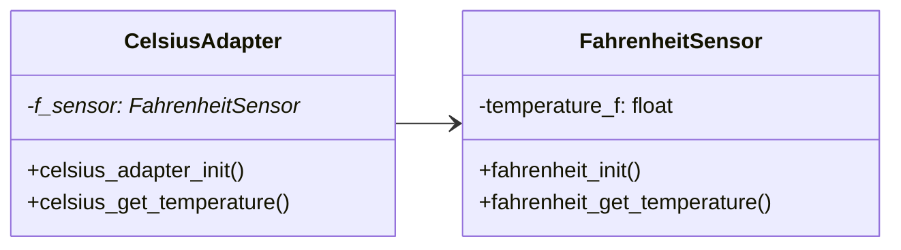

```mermaid
classDiagram
    direction LR
    
    class FahrenheitSensor {
        -temperature_f: float
        +fahrenheit_init()
        +fahrenheit_get_temperature()
    }
    
    class CelsiusAdapter {
        -f_sensor: FahrenheitSensor*
        +celsius_adapter_init()
        +celsius_get_temperature()
    }
    
    CelsiusAdapter --> FahrenheitSensor

```