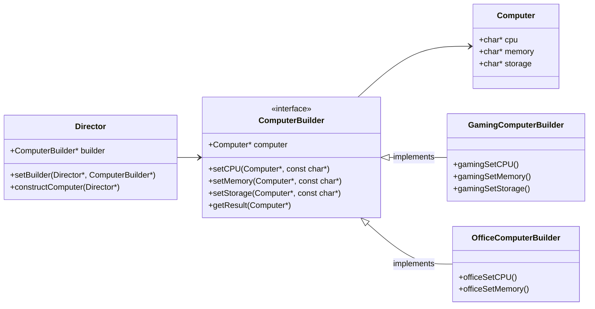

```mermaid
classDiagram
    direction LR
    
    class Director {
        +ComputerBuilder* builder
        +setBuilder(Director*, ComputerBuilder*)
        +constructComputer(Director*)
    }

    class ComputerBuilder {
        <<interface>>
        +Computer* computer
        +setCPU(Computer*, const char*)
        +setMemory(Computer*, const char*)
        +setStorage(Computer*, const char*)
        +getResult(Computer*)
    }

    class Computer {
        +char* cpu
        +char* memory
        +char* storage
    }

    class GamingComputerBuilder {
        +gamingSetCPU()
        +gamingSetMemory()
        +gamingSetStorage()
    }

    class OfficeComputerBuilder {
        +officeSetCPU()
        +officeSetMemory()
    }

    Director --> ComputerBuilder
    ComputerBuilder --> Computer
    ComputerBuilder <|-- GamingComputerBuilder : implements
    ComputerBuilder <|-- OfficeComputerBuilder : implements
```