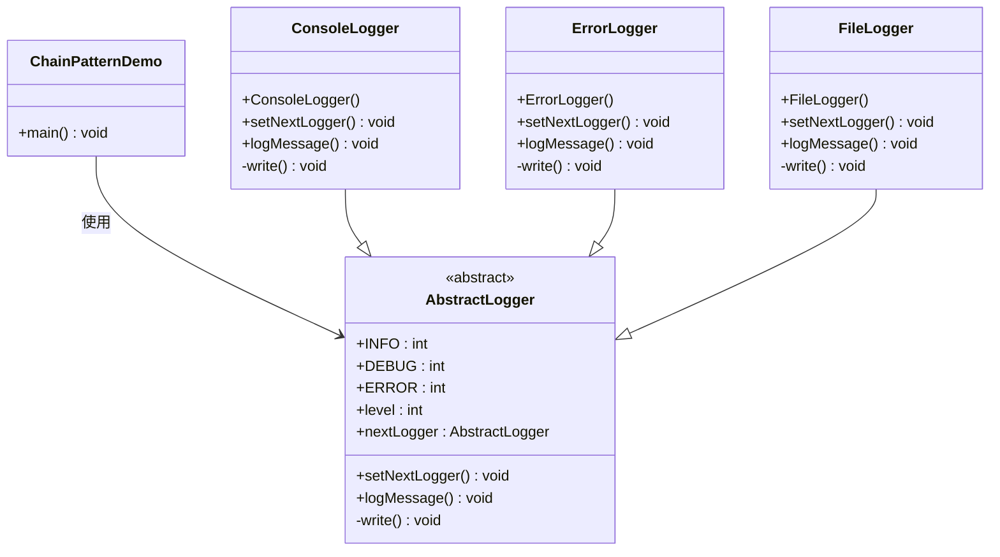

```mermaid
classDiagram
    class ChainPatternDemo {
        +main() void
    }

    class AbstractLogger {
        <<abstract>>
        +INFO : int
        +DEBUG : int
        +ERROR : int
        +level : int
        +nextLogger : AbstractLogger
        +setNextLogger() void
        +logMessage() void
        -write() void
    }

    class ConsoleLogger {
        +ConsoleLogger()
        +setNextLogger() void
        +logMessage() void
        -write() void
    }

    class ErrorLogger {
        +ErrorLogger()
        +setNextLogger() void
        +logMessage() void
        -write() void
    }

    class FileLogger {
        +FileLogger()
        +setNextLogger() void
        +logMessage() void
        -write() void
    }

    ChainPatternDemo --> AbstractLogger : 使用
    ConsoleLogger --|> AbstractLogger
    ErrorLogger --|> AbstractLogger
    FileLogger --|> AbstractLogger

```