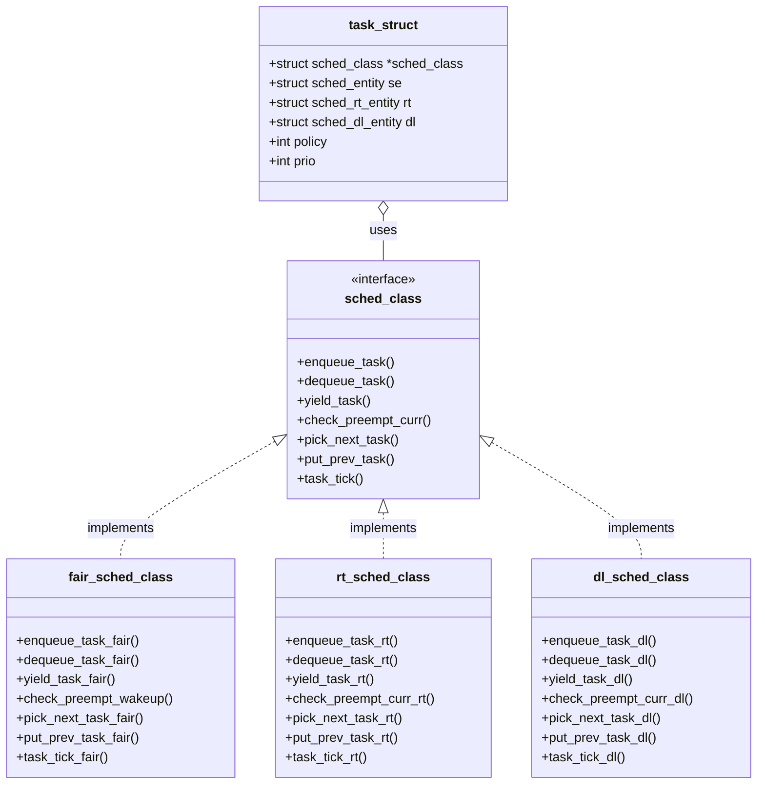

```mermaid
classDiagram
    class task_struct {
        +struct sched_class *sched_class
        +struct sched_entity se
        +struct sched_rt_entity rt
        +struct sched_dl_entity dl
        +int policy
        +int prio
    }

    class sched_class {
        <<interface>>
        +enqueue_task()
        +dequeue_task()
        +yield_task()
        +check_preempt_curr()
        +pick_next_task()
        +put_prev_task()
        +task_tick()
    }

    class fair_sched_class {
        +enqueue_task_fair()
        +dequeue_task_fair()
        +yield_task_fair()
        +check_preempt_wakeup()
        +pick_next_task_fair()
        +put_prev_task_fair()
        +task_tick_fair()
    }

    class rt_sched_class {
        +enqueue_task_rt()
        +dequeue_task_rt()
        +yield_task_rt()
        +check_preempt_curr_rt()
        +pick_next_task_rt()
        +put_prev_task_rt()
        +task_tick_rt()
    }

    class dl_sched_class {
        +enqueue_task_dl()
        +dequeue_task_dl()
        +yield_task_dl()
        +check_preempt_curr_dl()
        +pick_next_task_dl()
        +put_prev_task_dl()
        +task_tick_dl()
    }

    task_struct o-- sched_class : uses
    sched_class <|.. fair_sched_class : implements
    sched_class <|.. rt_sched_class : implements
    sched_class <|.. dl_sched_class : implements

```