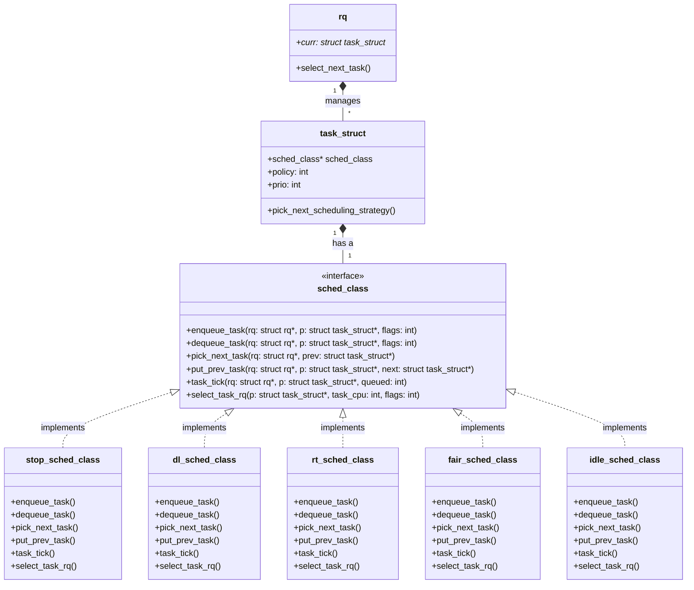

```mermaid
classDiagram
    class sched_class {
        <<interface>>
        +enqueue_task(rq: struct rq*, p: struct task_struct*, flags: int)
        +dequeue_task(rq: struct rq*, p: struct task_struct*, flags: int)
        +pick_next_task(rq: struct rq*, prev: struct task_struct*)
        +put_prev_task(rq: struct rq*, p: struct task_struct*, next: struct task_struct*)
        +task_tick(rq: struct rq*, p: struct task_struct*, queued: int)
        +select_task_rq(p: struct task_struct*, task_cpu: int, flags: int)
    }
    
    class stop_sched_class {
        +enqueue_task()
        +dequeue_task()
        +pick_next_task()
        +put_prev_task()
        +task_tick()
        +select_task_rq()
    }
    
    class dl_sched_class {
        +enqueue_task()
        +dequeue_task()
        +pick_next_task()
        +put_prev_task()
        +task_tick()
        +select_task_rq()
    }
    
    class rt_sched_class {
        +enqueue_task()
        +dequeue_task()
        +pick_next_task()
        +put_prev_task()
        +task_tick()
        +select_task_rq()
    }
    
    class fair_sched_class {
        +enqueue_task()
        +dequeue_task()
        +pick_next_task()
        +put_prev_task()
        +task_tick()
        +select_task_rq()
    }
    
    class idle_sched_class {
        +enqueue_task()
        +dequeue_task()
        +pick_next_task()
        +put_prev_task()
        +task_tick()
        +select_task_rq()
    }
    
    class task_struct {
        +sched_class* sched_class
        +policy: int
        +prio: int
        +pick_next_scheduling_strategy()
    }
    
    class rq {
        +curr: struct task_struct*
        +select_next_task()
    }
    
    sched_class <|.. stop_sched_class : implements
    sched_class <|.. dl_sched_class : implements
    sched_class <|.. rt_sched_class : implements
    sched_class <|.. fair_sched_class : implements
    sched_class <|.. idle_sched_class : implements
    
    task_struct "1" *-- "1" sched_class : has a
    rq "1" *-- "*" task_struct : manages

```